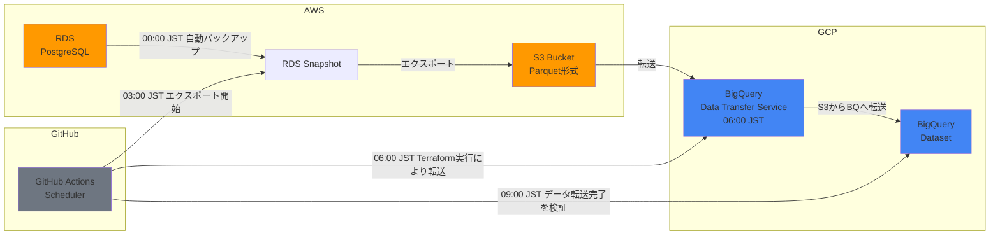

# TL;DR

AWS RDSの全テーブルをGCP BigQueryに日次同期する仕組みをGitHub ActionsとTerraformで内製した記録です。テーブルの追加にも自動で同期します。

# 対象読者

- AWS RDSのデータをGCP BigQueryで分析する仕組みを整えたい方

# はじめに

プレーリーカードはRailsアプリケーションで、AWS RDSのPostgreSQLをデータベースとして利用しています。そしてデータ分析のために、RDSのデータをBigQueryに日次で同期する仕組みを構築しています。BigQueryを使うことで、BIツールLooker Studioによるデータの可視化や、エンジニア以外でもAIを駆使してクエリを書いて分析できるようになりました。

# 全体アーキテクチャ

## 処理フロー

BQへの同期処理はGitHub Actionsでスケジュールされており、3時間ごとに各ステップが実行されます。日付が変わる0時過ぎにバックアップが取られてから、それを使い朝の9時にはデータの同期を完了させる設計です。

1. **00:00 JST**: RDSの自動バックアップが開始
2. **03:00 JST**: GitHub ActionsでRDSスナップショットをS3にエクスポートを実行
3. **06:00 JST**: Github ActionsでTerraformを実行し、BigQuery Data Transfer ServiceでS3からBigQueryへ転送
4. **09:00 JST**: データが正しく同期されているか確認ヘルスチェック


## アーキテクチャ図



# 実装詳細

## GitHub Actionsの設定

GitHub Actionsでは、3つのステップをscheduleとworkflow_dispatchで実行できるようにしています：

```yaml
name: BigQuery Sync Workflow

on:
  workflow_dispatch:
    inputs:
      step:
        required: false
        default: "health-check"
  schedule:
    - cron: "00 19 * * *" # 3am RDSのスナップショットをS3にエクスポートする
    - cron: "00 22 * * *" # 6am Terraformを実行し、BigQuery Data Transfer ServiceでS3からBigQueryへ転送
    - cron: "00 1 * * *"  # 9am データが正しく同期されているか確認ヘルスチェック

jobs:
  terraform:
    env:
      START_EXPORTING: ${{ (github.event.schedule == '00 19 * * *' || github.event.inputs.step == 'export') && 'yes' || 'no' }}
      START_TERRAFORM: ${{ (github.event.schedule == '00 22 * * *' || github.event.inputs.step == 'terraform') && 'yes' || 'no' }}
      START_HEALTH_CHECK: ${{ (github.event.schedule == '00 1 * * *' || github.event.inputs.step == 'health-check') && 'yes' || 'no' }}
```

### ステップ 1: RDSエクスポート

RDSのスナップショットをS3にエクスポートする処理です。

```yaml
- name: Clean previous export, and Move export files
  if: env.START_EXPORTING == 'yes'
  run: |
    # 前回のエクスポートをクリーンアップ
    aws s3 rm s3://my-rds-export-bucket/rds-export-task-for-bq --recursive
    
    # ユニークな識別子を生成（export-task-identifierの重複を避けるため）
    echo dump-$(date +%s) | aws s3 cp - s3://my-rds-export-bucket/scripts/dir_identifier.txt --content-type text/plain
    
    # エクスポートタスクを開始
    aws s3 cp s3://my-rds-export-bucket/scripts/start_export_task_command.sh - | bash
    
    # 日付キーを保存（BigQuery Data Transfer Serviceで使用）
    echo $(date +%Y%m%d) | aws s3 cp - s3://my-rds-export-bucket/scripts/date_key.txt --content-type text/plain
```

### ステップ 2: Terraform Apply

GCPのData Transfer Serviceでは、DB丸ごと(=全テーブル)を転送する便利な指示はできないので、テーブル一覧をクエリから無理やり取得しています。

```yaml
- name: Update table list
  if: env.START_TERRAFORM == 'yes'
  run: |
    # RDSエクスポートのメタデータからテーブル一覧を抽出
    aws s3 cp s3://my-rds-export-bucket/$(aws s3api list-objects-v2 \
      --bucket my-rds-export-bucket \
      --prefix "rds-export-task-for-bq/" \
      --query 'Contents[?contains(Key, `export_tables_info_`) && ends_with(Key, `.json`)].Key' \
      --output text) - | jq '.perTableStatus[].target | sub("<DB_NAME>.public."; "")' | jq -s > tables.json
    
    # テーブル一覧をS3に保存
    aws s3 cp tables.json s3://my-rds-export-bucket/rds-export-task-for-bq/tables.json

- name: Terraform apply
  if: env.START_TERRAFORM == 'yes'
  run: |
    terraform -chdir=only-bq-sync-place init -migrate-state
    terraform -chdir=only-bq-sync-place apply -auto-approve
```

### ステップ 3: ヘルスチェック

BigQueryに最新のデータが同期されているか確認しています。サンプルで特定のテーブルの最大のcreated_atを取得して、24時間以上経っていたら同期失敗としてSlack通知します。

```yaml
- name: Health check
  if: env.START_HEALTH_CHECK == 'yes'
  run: |
    bq_last_time=$(bq query --use_legacy_sql=false --format=csv 'SELECT created_at FROM `<DATASET_NAME>.<TABLE_NAME>` ORDER BY created_at DESC LIMIT 1' | tail -n 1)
    echo "bq_last_time: $bq_last_time"
    bq_last_time=$(date -d "$bq_last_time" +%s)
    now=$(date +%s)
    diff=$((now - bq_last_time))
    if [ $diff -gt 86400 ]; then
      echo "Data is not updated in 24 hours: $diff"
      exit 1
    fi
```

## Terraformの設定

### RDSエクスポートタスクの生成

Terraformでは、RDSのスナップショットをエクスポートするコマンドを動的に生成：

```hcl
locals {
  start_export_task_command = <<-EOT
    aws rds start-export-task \
        --s3-prefix rds-export-task-for-bq \
        --export-task-identifier $(aws s3 cp s3://${aws_s3_object.dir_identifier.bucket}/${aws_s3_object.dir_identifier.key} -)-$(date +%Y%m%d) \
        --source-arn $(aws rds describe-db-snapshots --db-instance-identifier ${data.aws_db_instance.rds.db_instance_identifier} --query "reverse(sort_by(DBSnapshots, &SnapshotCreateTime))[0].DBSnapshotArn" --output text) \
        --s3-bucket-name ${aws_s3_bucket.rds_export_bucket.bucket} \
        --iam-role-arn ${aws_iam_role.rds_export_role.arn} \
        --kms-key-id ${aws_kms_key.rds_export_key.arn}
  EOT
}
```

このコマンドの工夫点として、まずRDSのスナップショットは日次で複数作成されるため、`describe-db-snapshots`で取得した一覧を作成時刻でソートし、最新のものを自動選択するようにしています。

また、AWSのexport-task-identifierは一度使用した値を再利用できない仕様があるため、S3に保存したユニークな識別子とその日の日付を組み合わせることで、毎回異なるIDを生成しています。これにより、再実行時のエラーを回避できます。

### 自動同期の仕組み

テーブルが追加されても自動的に同期される仕組みを実装しています。削除されたテーブルはTerraform側でstate rmして、基本的にはBQ上には残しておく運用にしています。

```hcl
# S3からテーブル一覧を取得
data "aws_s3_object" "tables" {
  bucket = aws_s3_bucket.rds_export_bucket.bucket
  key    = "rds-export-task-for-bq/tables.json"
}

locals {
  tables = toset(jsondecode(data.aws_s3_object.tables.body))
}

# 動的にテーブルを作成
resource "google_bigquery_table" "main" {
  for_each = local.tables

  dataset_id          = data.google_bigquery_dataset.main.dataset_id
  table_id            = each.key
  deletion_protection = true
}

# 各テーブルに対してData Transfer Configを作成
resource "google_bigquery_data_transfer_config" "main" {
  for_each = local.tables

  display_name           = each.key
  location               = "asia-northeast1"
  data_source_id         = "amazon_s3"
  schedule               = "every 48 hours"
  destination_dataset_id = data.google_bigquery_dataset.main.dataset_id
  params = {
    destination_table_name_template = google_bigquery_table.main[each.key].table_id
    data_path = "s3://${aws_s3_bucket.rds_export_bucket.bucket}/rds-export-task-for-bq/${chomp(data.aws_s3_object.dir_identifier.body)}-${trimspace(data.aws_s3_object.date_key.body)}/<DB_NAME>/public.${each.key}/1/*.parquet"
    access_key_id     = aws_iam_access_key.bq_data_transfer_user_access_key.id
    secret_access_key = aws_iam_access_key.bq_data_transfer_user_access_key.secret
    file_format       = "PARQUET"
    write_disposition = "WRITE_TRUNCATE"
  }
}
```

通常、新しいテーブルが追加されるたびに手動でBigQueryのテーブル定義や転送設定を追加する必要があるかと重いますが、この仕組みでRDSエクスポート時に生成されるメタデータファイルからテーブル一覧を自動的に読み取り、この動的なテーブルリストに基づいて必要なリソースを自動生成します。誤操作でテーブルが削除されてしまわないよう、`deletion_protection = true` を設定しています。これにより、意図しないテーブル削除を防ぎつつ、柔軟な運用が可能になっています。

### 転送の強制実行

BigQuery Data Transfer Serviceは通常スケジュール実行ですが、取得先のS3のパスが変わってTerraform apply時に即座に実行させるために常にリソースを再作成しています。毎日再作成しているため、指定している属性`every 48 hours`は実際には使われることはありません。

```hcl
resource "null_resource" "always_run" {
  triggers = {
    timestamp = "${timestamp()}"
  }
}

resource "google_bigquery_data_transfer_config" "main" {
  # ...
  lifecycle {
    replace_triggered_by = [
      null_resource.always_run
    ]
  }
}
```

# 現在の課題と今後の展望

元々はRDSとBQ間の同期はFivetranを利用して丸投げしていましたが、レプリケーションの設定で一度不整合が起きてしまった後に、Fivetranがうまく動作できず簡単に解消できる見通しがなくなったため、突貫工事で同期する仕組みを作りリプレイスしました。スピード優先で現在は毎日全テーブルのデータを転送する構成に甘んじていますが、データ量の増加するたびに課金が大きくなるので差分のみの転送に切り替えたいです。記事の通り正規の実装らしからぬ荒いアプローチを採用している箇所も複数あり、そこも整えたいです。
